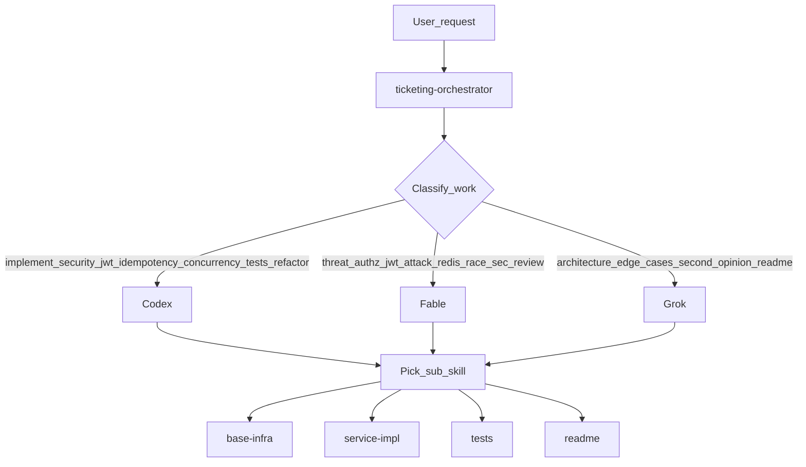

# Ticketing Multi-Agent Orchestrator

Ana skill. Kullanici istegini alt skill'lere ve agent modellerine map eder. Implementasyon
detayi alt skill'lerde kalir; bu dosya **kim ne yapar** kararini verir.

## Agent Rolleri

| Agent | Model (Task tool) | Guclu oldugu alanlar |
|---|---|---|
| **Codex** | `gpt-5.2-codex` | Spring Security, JWT filter/token service, idempotency, oversell concurrency, unit/integration test, repo-wide refactor |
| **Fable** | `claude-fable-5-thinking-high` | Threat modeling, AuthZ aciklari, JWT saldiri senaryolari, Redis session/revocation eleştirisi, race condition, Codex kodunun security review'u |
| **Grok** | `cursor-grok-4.5-high-fast` | Alternatif mimari, edge-case brainstorm, hizli ikinci gorus, README / aciklama uretimi |

## Skill → Agent Matrisi

| Alt skill | Primary | Secondary (review / brainstorm) |
|---|---|---|
| [ticketing-base-infra](../ticketing-base-infra/SKILL.md) (Skill 1) | **Codex** | Fable (JWT/session/rate-limit security), Grok (mimari sapma) |
| [ticketing-service-impl](../ticketing-service-impl/SKILL.md) (Skill 2) | **Codex** | Fable (idempotency/race/ownership), Grok (edge-case) |
| [ticketing-tests](../ticketing-tests/SKILL.md) (Skill 3) | **Codex** | Fable (security test senaryolari), Grok (eksik edge-case listesi) |
| [ticketing-readme](../ticketing-readme/SKILL.md) (Skill 4) | **Grok** | Codex (teknik dogruluk), Fable (security ADR) |

## Orchestration Akisi

### Adimlar (orchestrator agent)

1. Istegi siniflandir: implementasyon / security review / dokumantasyon-brainstorm.
2. Ilgili **alt skill**'i oku (`SKILL.md`).
3. `Task` tool ile uygun modele delege et (`subagent_type` + `model`):
   - Implementasyon / test / refactor → Codex + ilgili skill prompt'u
   - Security review / threat model → Fable + mevcut diff veya dosya listesi
   - README / mimari alternatif / edge-case → Grok + skill 4 veya soru ozeti
4. Codex cikti urettiyse **Fable** ile security review iste (JWT, AuthZ, Redis session, race).
5. Buyuk mimari sapma oncesi **Grok** ikinci gorus al.
6. Sonucu kullaniciya birlestir; hangi agent'in ne yaptigini kisaca belirt.

## Codex — Gorev Kataloğu

Primary owner. Alt skill talimatlarina gore **kod yazar**.

- Spring Security: `SecurityFilterChain`, filters, `oauth2ResourceServer`, permit/deny kurallari
- JWT: `JwtService`, `JwtProperties`, `JwtDecoder`, `JwtUserSessionConverter`
- Idempotency: Redis Hash, `IdempotencyService`, controller entegrasyonu
- Oversell: `@Version`, capacity check, retry (`TransactionTemplate`)
- Unit + integration + concurrency + gateway AuthZ testleri (skill 3)
- Repo-wide refactor (naming, path, header, Redis key tutarliligi)

**Calisma kurali:** Once ilgili `SKILL.md` oku; skill disina cikma. Derleme dogrula (`mvn compile` / `mvn test`).

## Fable — Gorev Katalogu

Primary: **security reviewer**. Kod yazmaz; bulgu + risk + oneri uretir. Codex cikti geldikten sonra calistir.

- Threat modeling (STRIDE veya kisa asset/threat listesi)
- Authorization aciklari (gateway coarse vs service fine-grained, header spoofing)
- JWT saldiri senaryolari (expired, revoked session, alg confusion, secret leak)
- Redis session/revocation tasarim elestirisi (TTL sync, refresh recreate, cluster)
- Race condition (reservation oversell, idempotency PROCESSING)
- Codex PR/diff security review (defect-first, actionable)

**Calisma kurali:** `security-review` subagent veya Fable model + diff. Bulgulari severity ile sirala. Fix icin Codex'e geri delege et.

## Grok — Gorev Katalogu

Primary: **hizli dusunme + dokumantasyon**.

- Alternatif mimari onerileri (thin JWT vs fat JWT, idempotency Redis vs DB, vb.)
- Edge-case brainstorm (liste; implementasyon Codex'e kalir)
- Hizli ikinci gorus (kisa trade-off)
- README / ADR / curl ornekleri / aciklama uretimi (skill 4)

**Calisma kurali:** Uzun implementasyon yazma. Ciktiyi skill 4 formatina veya karar notuna cevir; onay sonrasi Codex uygular.

## Tipik Senaryolar

| Kullanici der | Orchestrator yapar |
|---|---|
| "Gateway JWT ve rate limit duzelt" | Skill 1 → **Codex**; bitince **Fable** review |
| "Idempotency / oversell ekle" | Skill 2 → **Codex**; **Fable** race review |
| "Testleri yaz" | Skill 3 → **Codex**; **Grok** eksik case listesi; security testleri icin **Fable** senaryo |
| "README yaz" | Skill 4 → **Grok**; teknik kontrol **Codex** |
| "Bu PR guvenli mi?" | **Fable** security review (Codex yazdiysa) |
| "Baska mimari olur mu?" | **Grok** alternatifler; secim sonrasi skill + **Codex** |

## Alt Skill Tetikleme Sirasi (greenfield)

1. Skill 1 base-infra → Codex (+ Fable review)
2. Skill 2 service-impl → Codex (+ Fable race/idempotency)
3. Skill 3 tests → Codex (+ Grok edge-cases)
4. Skill 4 readme → Grok

## Kritik Kurallar

- Orchestrator tek basina buyuk kod yazmaz; delege eder.
- Codex implement eder, Fable denetler, Grok aciklar/brainstorm eder — roller karismaz.
- Alt skill path/header/Redis kararlari (`/api/ticket`, thin headers, `TICKET:` prefix) **degistirilmez** (Grok alternatif onerirse ayri karar olarak kullaniciya sor).
- Plan file'lari kullanici istemedikce duzenlenmez.
