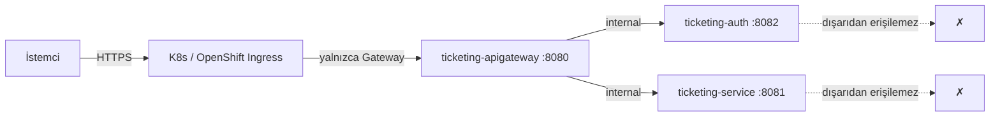
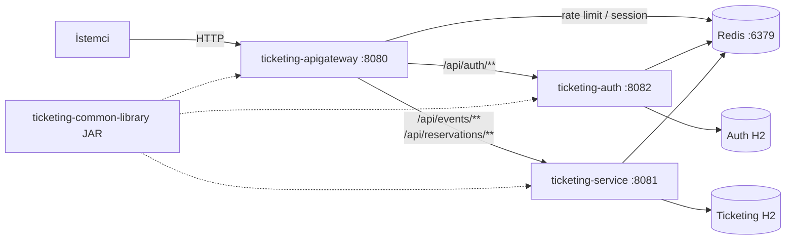
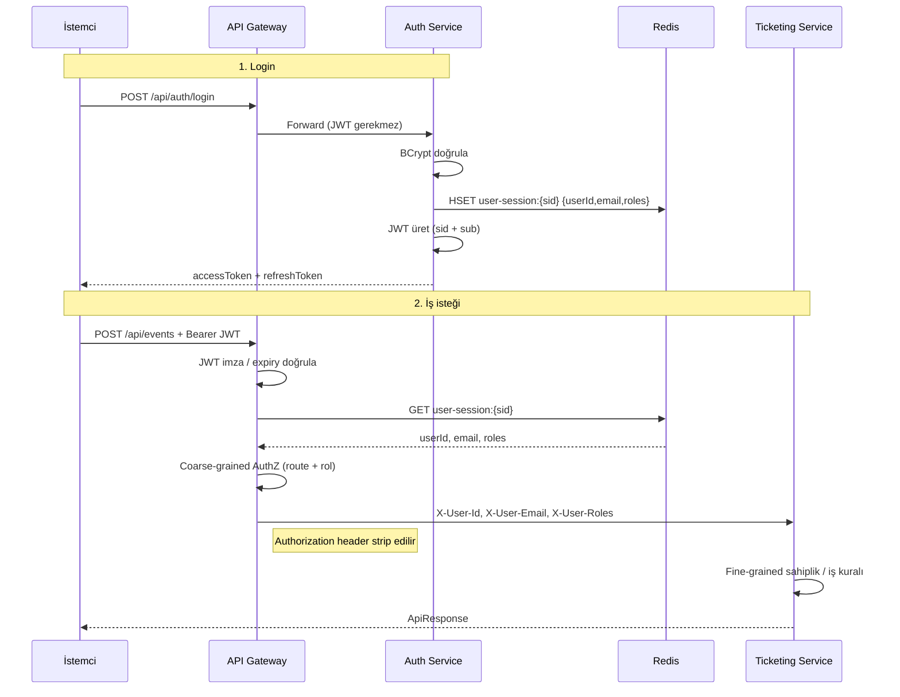
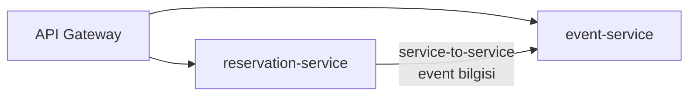

# Secure Ticketing & Reservation API

Java 21 ve Spring Boot 4 ile geliştirilmiş, JWT tabanlı kimlik doğrulama ve Redis rate limiting kullanan etkinlik / rezervasyon platformu. Dört mikroservisten oluşur.

---

## Varsayımlar

Aşağıdaki varsayımlar mimari ve güvenlik modelinin temelini oluşturur:

1. **Tek giriş noktası (Ingress)**
  Kubernetes veya OpenShift ortamında **yalnızca** `ticketing-apigateway` **Ingress/Route ile dışarı açılır**.  
   Downstream mikroservisler (`ticketing-auth`, `ticketing-service`) cluster-internal kalır; internetten veya cluster dışından doğrudan çağrılamaz.
2. **Güvenilir iç ağ**
  Gateway → Auth / Ticketing trafiği güvenilir network (cluster mesh / private network) üzerinden akar. Downstream servisler kimliği Gateway’in ilettiği header’lardan (`X-User-Id`, `X-User-Email`, `X-User-Roles`) okur; JWT’yi yeniden doğrulamaz.
3. **Tüm istemci istekleri Gateway üzerinden**
  Lokal geliştirmede bile API çağrıları `http://localhost:8080` üzerinden yapılmalıdır. Auth ve Ticketing portlarına (8082 / 8081) doğrudan erişim yalnızca debug / Swagger amaçlıdır.




---


## 1. Ana Mimari




| Proje                        | Port | Sorumluluk                                                                                                       |
| ---------------------------- | ---- | ---------------------------------------------------------------------------------------------------------------- |
| **ticketing-common-library** | —    | Paylaşılan JAR: `ApiResponse`, exception’lar, `JwtService`, util’ler                                             |
| **ticketing-apigateway**     | 8080 | JWT doğrulama, Redis session okuma, **coarse-grained** yetkilendirme, rate limiting, routing, header enjeksiyonu |
| **ticketing-auth**           | 8082 | Register, login, logout, refresh; JWT üretimi; Redis session yazma                                               |
| **ticketing-service**        | 8081 | Event CRUD, rezervasyon, idempotency, audit; fine-grained sahiplik kontrolleri                                   |


### Bileşen sınırları


| Katman        | Ne yapar                                                                                 | Ne yapmaz                            |
| ------------- | ---------------------------------------------------------------------------------------- | ------------------------------------ |
| **Gateway**   | Token doğrular, rol bazlı route kontrolü, rate limit, kullanıcı bilgisini header’a yazar | İş kuralı / sahiplik kontrolü yapmaz |
| **Auth**      | Kullanıcı + refresh token + Redis session yönetir                                        | Event / rezervasyon bilmez           |
| **Ticketing** | Domain mantığı, optimistic lock, idempotency                                             | JWT üretmez / doğrulamaz             |


---


## 2. Authentication / Authorization (Coarse-grained) ve JWT Akışı


### Roller


| Rol           | Erişim özeti                              |
| ------------- | ----------------------------------------- |
| **ADMIN**     | Tüm kaynaklara tam erişim                 |
| **ORGANIZER** | Sahip olduğu event’ler üzerinde tam yetki |
| **CUSTOMER**  | Rezervasyon oluşturma / onay / iptal      |


### Coarse-grained kurallar (Gateway)


| Route                         | Method    | İzin                             |
| ----------------------------- | --------- | -------------------------------- |
| `/api/auth/**`                | ANY       | Public (JWT yok)                 |
| `/api/events/public/**`       | GET       | Public (JWT yok)                 |
| `/api/events/**`              | POST, PUT | ORGANIZER, ADMIN                 |
| `/api/events`                 | GET       | Authenticated (herhangi bir rol) |
| `/api/events/*/reservations`  | POST      | CUSTOMER                         |
| `/api/reservations/*/confirm` | POST      | CUSTOMER                         |
| `/api/reservations/*/cancel`  | POST      | CUSTOMER                         |


Fine-grained kurallar (ör. “bu event benim mi?”) **ticketing-service** içinde uygulanır.

### JWT + Redis session modeli

JWT ince bir pointer’dır; roller ve kullanıcı kimliği Redis’te tutulur.




### Örnek JWT payload

```json
{
  "sub": "organizer@ticketing.com",
  "sid": "550e8400-e29b-41d4-a716-446655440000",
  "iat": 1721300000,
  "exp": 1721301800
}
```

Redis Hash (`user-session:{sid}`):

```
userId: "2"
email:  "organizer@ticketing.com"
roles:  "ORGANIZER"
```


| Konu            | Nerede                | Nasıl                                        |
| --------------- | --------------------- | -------------------------------------------- |
| Token üretimi   | Auth                  | `JwtService.generateToken(sessionId, email)` |
| Session saklama | Auth → Redis          | `{userId, email, roles}`, TTL ≈ access token |
| Token doğrulama | Gateway               | İmza + Redis `sid` lookup                    |
| Anında iptal    | Auth (logout/refresh) | Redis key silinir → JWT geçersizleşir        |
| Coarse AuthZ    | Gateway               | Route + method + roller                      |
| Fine AuthZ      | Ticketing             | Ownership / kapasite / durum                 |


---


## 3. Gelecekte Yapılacaklar


### 3.1 Yapılandırmanın Spring Cloud Config’e taşınması

- Servislerdeki `application.yml` içindeki ortam bağımlı ayarlar (JWT secret, Redis, route URI’leri, rate limit) **Spring Cloud Config Server**’a taşınacak.
- Amaç: deploy başına config değişikliği, merkezi secret yönetimi, ortam (dev/test/prod) ayrımı.
- MayaCore Config Server / `cloud_config` modeli ile hizalanması hedeflenir.


### 3.2 Ticketing servisinin iki mikroservise bölünmesi

Mevcut `ticketing-service` (event + reservation) ayrılacak:


| Hedef servis            | Sorumluluk                                                   |
| ----------------------- | ------------------------------------------------------------ |
| **event-service**       | Event CRUD, publish, public discovery                        |
| **reservation-service** | Rezervasyon create / confirm / cancel, idempotency, kapasite |


**Service-to-service çağrı:**  
Reservation servisi, event kapasitesi / yayın durumu gibi bilgileri event-service’ten **internal API call** ile alacak.

Değerlendirilecek seçenekler:

- Spring Security resource server + client credentials (servis kimliği)
- OpenFeign / `CommonClientFactory` ile tip güvenli istemci
- Network policy ile yalnızca Gateway + trusted callers’a izin




### 3.3 Keycloak entegrasyonu

Keycloak hem **kullanıcı** hem **servis çağrıları** için değerlendirilecek:


| Kullanım                       | Amaç                                                                 |
| ------------------------------ | -------------------------------------------------------------------- |
| **User authentication**        | Login / SSO; mevcut custom JWT+session modelinin yerine veya yanında |
| **Service accounts**           | Reservation → Event gibi S2S çağrılarda client credentials           |
| **Realm / client rolleri**     | ADMIN, ORGANIZER, CUSTOMER ve servis rollerinin merkezi yönetimi     |
| **Token introspection / JWKS** | Gateway’de imza doğrulama standardizasyonu                           |


Bu adım, custom Auth servisinin sadeleştirilmesi veya Keycloak’a delege edilmesi kararını da beraberinde getirecektir.

---


## Önkoşullar

- Java 21+
- Maven 3.9+
- Redis 7+ (`brew install redis`)


## Hızlı Başlangıç

```bash
# 1. Common Library
cd ticketing-common-library && mvn clean install

# 2. Redis
redis-server

# 3. Auth (yeni terminal) — :8082
cd ticketing-auth && mvn spring-boot:run

# 4. Ticketing (yeni terminal) — :8081
cd ticketing-service && mvn spring-boot:run

# 5. Gateway (yeni terminal) — :8080
cd ticketing-apigateway && mvn spring-boot:run

# 6. Login testi (her zaman Gateway üzerinden)
curl -s -X POST http://localhost:8080/api/auth/login \
  -H "Content-Type: application/json" \
  -d '{"email":"organizer@ticketing.com","password":"ChangeMe123!"}'
```


## Seed Kullanıcılar


| E-posta                                                   | Rol       | Şifre        |
| --------------------------------------------------------- | --------- | ------------ |
| [admin@ticketing.com](mailto:admin@ticketing.com)         | ADMIN     | ChangeMe123! |
| [organizer@ticketing.com](mailto:organizer@ticketing.com) | ORGANIZER | ChangeMe123! |
| [customer@ticketing.com](mailto:customer@ticketing.com)   | CUSTOMER  | ChangeMe123! |


## OpenAPI

```
 http://localhost:8080/swagger-ui.html->downstream api'leri listeleyecek sekilde dökümantasyon olustur
Auth Swagger:       http://localhost:8082/swagger-ui.html
Ticketing Swagger:  http://localhost:8081/swagger-ui.html
```

İstemci trafiği için giriş noktası: **[http://localhost:8080](http://localhost:8080)** (Gateway).

## Alt Projeler

- [ticketing-common-library](./ticketing-common-library/README.md)
- [ticketing-auth](./ticketing-auth/README.md)
- [ticketing-apigateway](./ticketing-apigateway/README.md)
- [ticketing-service](./ticketing-service) *(README eklenecek)*

Detaylı plan: [ticket-plan.md](./ticket-plan.md)