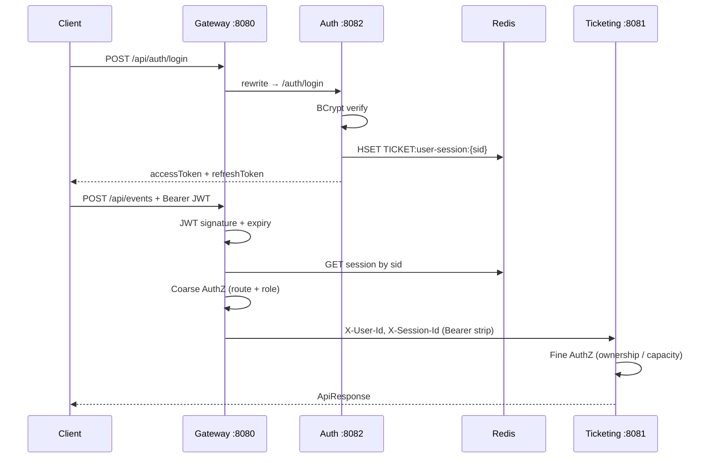
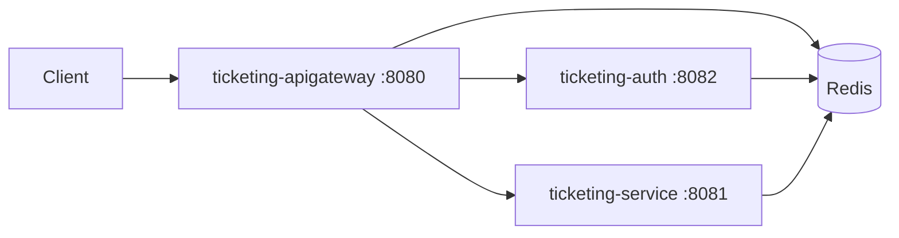

# Secure Ticketing & Reservation API

Java 21 + Spring Boot 4 event / reservation platformu. JWT kimlik doğrulama, Redis session + rate limiting, gateway üzerinden coarse-grained yetkilendirme.

| Servis | Port | Rol |
|---|---|---|
| `ticketing-apigateway` | 8080 | Tek dış giriş: JWT, AuthZ, rate limit, routing |
| `ticketing-auth` | 8082 | Register / login / refresh / logout |
| `ticketing-service` | 8081 | Event + rezervasyon domain |
| `ticketing-common-library` | — | Paylaşılan `ApiResponse`, exception, JWT, util |

**İstemci trafiği her zaman Gateway üzerinden:** `http://localhost:8080`  
Public path prefix: `/api/**` (gateway `RewritePath` ile downstream `/auth`, `/events`, `/reservations`).

---

## Prerequisites

- Java 21+
- Maven 3.9+ (Gradle kullanılmıyor)
- Redis 7+ (cluster veya tek node)

---

## Setup / Quick Start

### 1) Bağımlılıklar

```bash
# Common library (diğer modüller buna bağımlı)
cd ticketing-common-library && mvn clean install && cd ..

# Redis (lokal kurulum)
# brew install redis && redis-server
```

Ortam değişkenleri (yoksa `application.yml` default’ları kullanılır):

| Değişken | Açıklama |
|---|---|
| `JWT_SECRET` | Base64 HS256 secret |
| `GATEWAY_SHARED_SECRET` | Gateway → service trust token |
| `REDIS_NODE_1..3` | Cluster node `host:port` |
| `REDIS_PASSWORD` | Redis şifresi |

### 2) Servisleri başlat (ayrı terminaller)

```bash
cd ticketing-auth && mvn spring-boot:run          # :8082
cd ticketing-service && mvn spring-boot:run       # :8081
cd ticketing-apigateway && mvn spring-boot:run    # :8080
```

### H2 Console

Servis ayaktayken:

| Servis | Console | JDBC URL | User | Password |
|---|---|---|---|---|
| Auth | http://localhost:8082/h2-console | `jdbc:h2:file:./data/authdb` | `sa` | *(boş)* |
| Ticketing | http://localhost:8081/h2-console | `jdbc:h2:file:./data/ticketingdb` | `sa` | *(boş)* |

Saved Settings: Generic H2 (Embedded). Password alanını tamamen boş bırakın.
### 3) Smoke test

```bash
curl -s -X POST http://localhost:8080/api/auth/login \
  -H "Content-Type: application/json" \
  -d '{"email":"organizer@ticketing.com","password":"ChangeMe123!"}'
```

### Tests

```bash
cd ticketing-auth && mvn test
cd ticketing-service && mvn test
cd ticketing-apigateway && mvn test
# Coverage: */target/site/jacoco/index.html
```

---

## Auth flow (with sample JWT)

### Adımlar

1. **Register** — `POST /api/auth/register`
2. **Login** — `POST /api/auth/login` → `accessToken` + `refreshToken`
3. **İş isteği** — `Authorization: Bearer <accessToken>`
4. **Refresh** — `POST /api/auth/refresh` (rotation)
5. **Logout** — `POST /api/auth/logout` (Redis session + refresh iptal)



### Curl örnekleri

```bash
# Login
TOKEN=$(curl -s -X POST http://localhost:8080/api/auth/login \
  -H "Content-Type: application/json" \
  -d '{"email":"customer@ticketing.com","password":"ChangeMe123!"}' \
  | jq -r '.data.accessToken')

# Public discovery
curl -s "http://localhost:8080/api/events/public"

# Authenticated list
curl -s "http://localhost:8080/api/events" \
  -H "Authorization: Bearer $TOKEN"
```

### Sample JWT

Access token **HS256**, TTL **30 dk**. Claims kasıtlı olarak ince tutulur; roller Redis session’dadır.

**Header**

```json
{ "alg": "HS256", "typ": "JWT" }
```

**Payload**

```json
{
  "sub": "organizer@ticketing.com",
  "sid": "550e8400-e29b-41d4-a716-446655440000",
  "iat": 1721300000,
  "exp": 1721301800
}
```

**Redis** `TICKET:user-session:{sid}`

```
userId = 2
email  = organizer@ticketing.com
roles  = ORGANIZER
```

Logout / refresh rotation Redis key’i siler → access token anında geçersizleşir (imza hâlâ geçerli olsa bile).

### Coarse-grained kurallar (Gateway)

| Route | Method | İzin |
|---|---|---|
| `/api/auth/**` | ANY | Public |
| `/api/events/public/**` | GET | Public |
| `/api/events` | GET | Authenticated |
| `/api/events/**` | POST, PUT, DELETE | **ORGANIZER, ADMIN** |
| `/api/events/*/reservations` | POST | **CUSTOMER** (`/api/events/{eventId}/reservations`) |
| `/api/reservations/*/confirm` | POST | **CUSTOMER** |
| `/api/reservations/*/cancel` | POST | **CUSTOMER** |

**403 ACCESS_DENIED:** Yanlış rol (ör. `customer@...` ile event create).  
Event için `organizer@ticketing.com` / `admin@ticketing.com`, rezervasyon için `customer@ticketing.com` kullanın.  
Rezervasyon URL’si: `POST /api/events/{eventId}/reservations` — `/api/events/reservations` değil (eventId zorunlu).  
İstekleri **Gateway** (`:8080`) üzerinden atın; Swagger `:8081` için `X-Gateway-Secret` + `X-User-Id` gerekir.
---

## Architectural decisions (ADR)

### ADR-1 — Dört ayrı Maven modülü

Common library + gateway + auth + ticketing. Cross-cutting concerns gateway’de; domain ticketing’de; kimlik auth’ta. Tek monolith’e göre sınırlar net, değerlendirme ve ölçekleme kolay.

### ADR-2 — Thin JWT + Redis session

JWT yalnızca `sid` + `sub` taşır. Roller Redis’te. Avantaj: logout/refresh ile anında iptal; token şişmez. Dezavantaj: her authenticated istekte Redis lookup (kabul edilebilir).

### ADR-3 — Coarse AuthZ gateway’de, fine AuthZ service’te

Gateway route/method/rol kontrolü yapar; “bu event benim mi?” gibi iş kuralları ticketing’de kalır. Gateway şişmez, domain sızıntısı olmaz.

### ADR-4 — Downstream’e sadece identity header + gateway secret

Gateway → service: `X-User-Id`, `X-Session-Id`, `X-Gateway-Secret`. Bearer strip edilir. Service, secret yoksa identity header’ları yok sayar (doğrudan :8081 spoof koruması).

### ADR-5 — Oversell koruması = `@Version` + retry

`Event.reservedSeats` optimistic lock. Pessimistic lock’a göre daha ölçeklenebilir; concurrency test ile doğrulanır.

### ADR-6 — Idempotency Redis’te

`POST .../reservations` için zorunlu `Idempotency-Key`. Redis Hash + TTL; aynı key + aynı body → cached response; body mismatch → business error.

### ADR-7 — Rate limit Redis’te (gateway)

Login bucket daha sıkı; authenticated / anonymous ayrı limit. Brute-force ve abuse’e karşı ilk savunma hattı.

### ADR-8 — Public register yalnızca CUSTOMER

ADMIN / ORGANIZER seed (veya ops) ile oluşturulur; self-assign kapatıldı.

---

## Seed users

Uygulama açılışında `SeedDataConfig` ile oluşur:

| Email | Role | Password |
|---|---|---|
| admin@ticketing.com | ADMIN | ChangeMe123! |
| organizer@ticketing.com | ORGANIZER | ChangeMe123! |
| customer@ticketing.com | CUSTOMER | ChangeMe123! |

---

## OpenAPI

| Servis | Swagger UI | OpenAPI JSON |
|---|---|---|
| Auth | http://localhost:8082/swagger-ui.html | http://localhost:8082/v3/api-docs |
| Ticketing | http://localhost:8081/swagger-ui.html | http://localhost:8081/v3/api-docs |

Swagger debug için doğrudan service portlarına gider. **Üretim / demo API çağrıları** Gateway `:8080` üzerinden yapılmalıdır.

---

## Varsayımlar

1. Dışarı yalnızca `ticketing-apigateway` açılır (K8s/OpenShift Ingress).
2. Gateway → auth/ticketing güvenilir internal network.
3. Lokal geliştirmede de istemci `http://localhost:8080` kullanır.



---

## Gelecekte

- Merkezi config (Config Server)
- Event / reservation servis ayrımı + S2S auth
- Keycloak (user + service accounts)

## Alt projeler

- [ticketing-common-library](./ticketing-common-library/README.md)
- [ticketing-auth](./ticketing-auth/README.md)
- [ticketing-apigateway](./ticketing-apigateway/README.md)
- [ticketing-service](./ticketing-service/README.md)

Plan: [ticket-plan.md](./ticket-plan.md)
