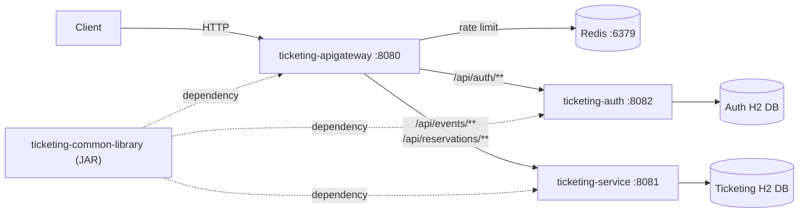
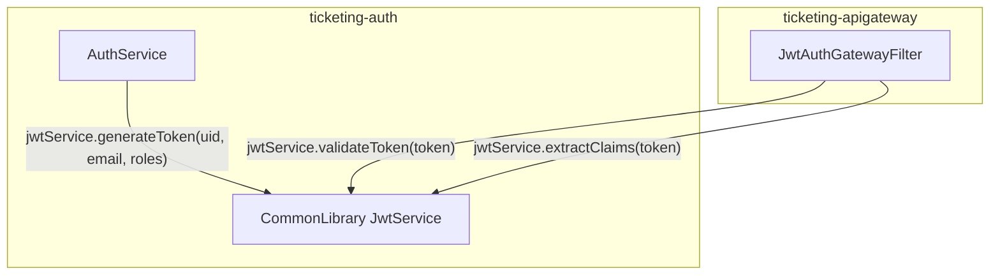
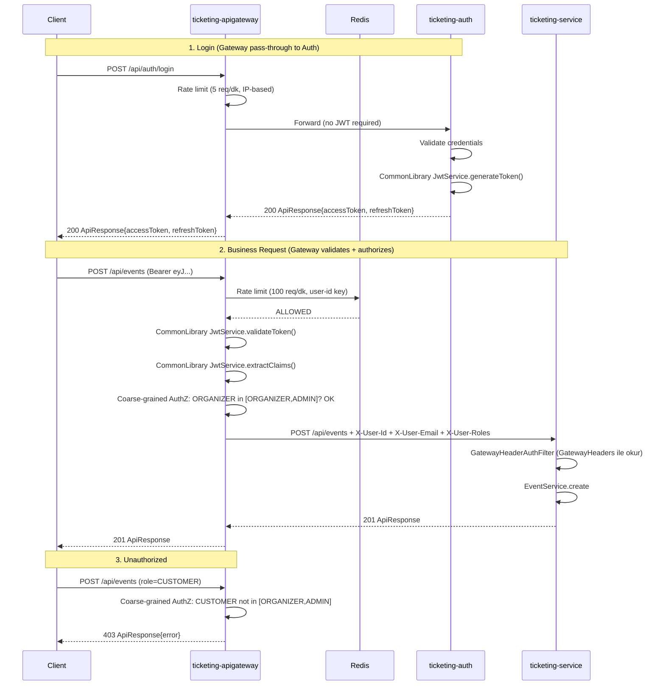
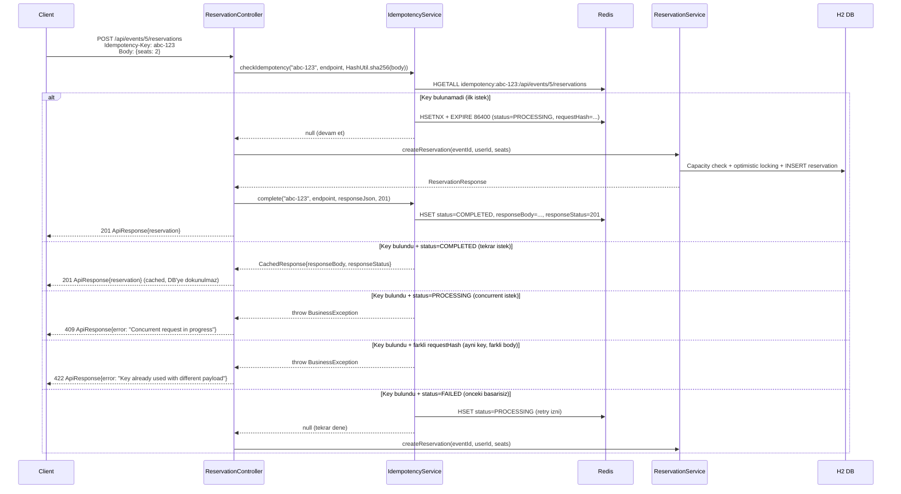

# Secure Ticketing & Reservation API - Uygulama Plani (v6)

## Mevcut Durum

- Disk uzerinde hicbir dosya mevcut degil, her sey sifirdan olusturulacak.
- PDF'teki case study gereksinimleri ve degerlendirme rubric'i temel alinacak.

## Mimari Genel Bakis

Dort bagimsiz proje ayni repo altinda yan yana duracak. JWT islemleri dahil tum ortak yetenek CommonLibrary'de.



| Proje | Port | Sorumluluk |
|---|---|---|
| **ticketing-common-library** | -- | Shared JAR: ApiResponse, Exception, GlobalExceptionHandler, **JwtService**, JwtProperties, HashUtil, GatewayHeaders, DateUtil |
| **ticketing-apigateway** | 8080 | JWT **validation** (CommonLibrary JwtService ile), rate limiting, coarse-grained authZ, routing, header injection |
| **ticketing-auth** | 8082 | Register, login, logout, refresh -- JWT **uretimi** (CommonLibrary JwtService ile) |
| **ticketing-service** | 8081 | Event CRUD, reservation, idempotency, audit -- auth/authZ yapmaz |

## Teknik Kararlar

- **Spring Boot 4.0.x** (case study'de acikca istenmis)
- **Spring Cloud Gateway** (reactive, ticketing-apigateway icin)
- **Java 21**
- **Redis** -- rate limiting + idempotency cache icin (lokal kurulum, docker-compose yok)
- **H2** in-memory veritabani (auth ve ticketing icin ayri instance)
- **JJWT 0.12.6** (HS256) -- **sadece CommonLibrary'de dependency**, diger projelere transitive gelir
- **springdoc-openapi 2.7.0** -- ticketing-service ve ticketing-auth'da
- **JaCoCo** test coverage
- MayaCore workspace kurallarina uyum

---

## Proje 0: ticketing-common-library

Ortak JAR kutuphanesi. JJWT dependency dahil tum shared yetenek burada. Diger uc proje bunu dependency olarak kullanir.

### Icerik

| Sinif | Package | Aciklama |
|---|---|---|
| `ApiResponse<T>` | `dto` | Standart response wrapper (success/error factory) |
| `BusinessException` | `exception` | Is kurali ihlalleri (4xx) |
| `SystemException` | `exception` | Sistem hatalari (5xx) |
| `GlobalExceptionHandler` | `exception` | `@ControllerAdvice`: framework exception'larini yakalar, `ApiResponse` formatinda doner. RULE-2 uyumlu. |
| **`JwtService`** | `security` | `generateToken(uid, email, roles)`, `validateToken(token)`, `extractClaims(token)` -- HS256, JJWT |
| **`JwtProperties`** | `security` | `@ConfigurationProperties(prefix="security.jwt")`: secret, accessTtlMinutes, refreshTtlDays |
| `HashUtil` | `util` | SHA-256 hash uretimi |
| `GatewayHeaders` | `util` | `X-User-Id`, `X-User-Email`, `X-User-Roles`, `X-Forwarded-For`, `Idempotency-Key` constant'lari |
| `DateUtil` | `util` | Tarih formatlama, timezone donusumleri, ISO-8601 parse/format |

### JwtService Kullanim Senaryolari



- `ticketing-auth` --> `jwtService.generateToken()` cagirir (login/refresh'te)
- `ticketing-apigateway` --> `jwtService.validateToken()` + `extractClaims()` cagirir (her istekte)
- `ticketing-service` --> JwtService **kullanmaz** (header'lardan okur)
- Ayni `security.jwt.secret` property'si auth ve gateway'in `application.yml`'inde tanimlanir

### Dosya Yapisi

```
ticketing-common-library/
├── pom.xml
└── src/main/java/com/turkcell/mayacore/commonlibrary/
    ├── dto/
    │   └── ApiResponse.java
    ├── exception/
    │   ├── BusinessException.java
    │   ├── SystemException.java
    │   └── GlobalExceptionHandler.java
    ├── security/
    │   ├── JwtService.java
    │   └── JwtProperties.java
    └── util/
        ├── HashUtil.java
        ├── GatewayHeaders.java
        └── DateUtil.java
```

---

## Proje 1: ticketing-auth

Kullanici yonetimi ve JWT token uretiminden sorumlu bagimsiz servis. CommonLibrary'deki `JwtService.generateToken()` ile token uretir.

### Sorumluluklar

- User **register** (varsayilan rol: CUSTOMER)
- User **login** (CommonLibrary JwtService ile JWT access + refresh token uretimi)
- User **logout** (refresh token invalidation)
- **Refresh token** flow (rotate on use)
- Seed users

### API Endpointleri

| Method | Path | Aciklama | Auth |
|---|---|---|---|
| POST | `/api/auth/register` | Yeni kullanici kaydi | Public |
| POST | `/api/auth/login` | JWT access + refresh token | Public |
| POST | `/api/auth/logout` | Refresh token iptal | Authenticated |
| POST | `/api/auth/refresh` | Yeni access token | Public (refresh token ile) |

### JWT Token Yapisi (CommonLibrary JwtService uretir)

```json
{
  "sub": "user@email.com",
  "uid": 42,
  "roles": ["ORGANIZER"],
  "iat": 1721300000,
  "exp": 1721301800
}
```

- Access token: 30 dk, HS256
- Refresh token: 7 gun, UUID-based, DB'de saklanir

### Dosya Yapisi

```
ticketing-auth/
├── pom.xml
├── README.md
├── src/main/java/com/turkcell/mayacore/auth/
│   ├── AuthApplication.java
│   ├── config/
│   │   ├── SecurityConfig.java
│   │   └── SeedDataConfig.java
│   ├── controller/
│   │   └── AuthController.java
│   ├── domain/
│   │   ├── User.java
│   │   ├── Role.java
│   │   └── RefreshToken.java
│   ├── dto/
│   │   ├── AuthLoginRequest.java
│   │   ├── AuthRegisterRequest.java
│   │   ├── AuthRefreshRequest.java
│   │   ├── AuthLogoutRequest.java
│   │   └── AuthResponse.java
│   ├── repository/
│   │   ├── UserRepository.java
│   │   └── RefreshTokenRepository.java
│   └── service/
│       └── AuthService.java
├── src/main/resources/
│   └── application.yml
└── src/test/
    └── java/com/turkcell/mayacore/auth/
        ├── AuthControllerTest.java
        └── AuthServiceTest.java
```

---

## Proje 2: ticketing-apigateway

Merkezi giris noktasi. CommonLibrary'deki `JwtService.validateToken()` ile token dogrulama, coarse-grained authorization ve rate limiting yapar.

### Sorumluluklar

| Katman | Sorumluluk |
|---|---|
| **JWT Validation** | CommonLibrary `JwtService.validateToken()` + `extractClaims()` ile |
| **Coarse-grained AuthZ** | Route bazli rol kontrolu |
| **Rate Limiting** | Redis-backed, endpoint bazli |
| **Routing** | `/api/auth/**` -> ticketing-auth, diger -> ticketing-service |
| **Header Injection** | `GatewayHeaders` constant'lari ile user bilgisini downstream'e iletir |

### Request Akisi



### Coarse-grained Authorization Kurallari

| Route Pattern | Izin Verilen Roller | Yonlendirme |
|---|---|---|
| `/api/auth/**` | PERMIT_ALL | ticketing-auth :8082 |
| `GET /api/events/public/**` | PERMIT_ALL | ticketing-service :8081 |
| `POST /api/events/**` | ORGANIZER, ADMIN | ticketing-service :8081 |
| `PUT /api/events/**` | ORGANIZER, ADMIN | ticketing-service :8081 |
| `GET /api/events` | Authenticated (any) | ticketing-service :8081 |
| `POST /api/events/*/reservations` | CUSTOMER | ticketing-service :8081 |
| `POST /api/reservations/*/confirm` | CUSTOMER | ticketing-service :8081 |
| `POST /api/reservations/*/cancel` | CUSTOMER | ticketing-service :8081 |
| `/actuator/**` | PERMIT_ALL | self |

### Rate Limiting

- Redis-backed `RedisRateLimiter`
- `/api/auth/login`: 5 req/dk, IP-based key
- Authenticated: 100 req/dk, user-id-based key
- Anonim: 50 req/dk, IP-based key

### Dosya Yapisi

```
ticketing-apigateway/
├── pom.xml
├── README.md
├── src/main/java/com/turkcell/mayacore/apigateway/
│   ├── ApiGatewayApplication.java
│   ├── config/
│   │   └── RouteConfig.java
│   └── filter/
│       └── JwtAuthGatewayFilter.java
├── src/main/resources/
│   └── application.yml
└── src/test/
    └── java/com/turkcell/mayacore/apigateway/
        └── RouteAuthorizationTest.java
```

Gateway projesi cok yalin: `JwtService` ve `JwtProperties` CommonLibrary'den gelir, `GatewayHeaders` CommonLibrary'den gelir. Sadece `JwtAuthGatewayFilter` ve `RouteConfig` kendine ait.

---

## Proje 3: ticketing-service

Event ve reservation is mantigi servisi. JWT ile isi yok, CommonLibrary'den `GatewayHeaders`, `HashUtil`, `ApiResponse` kullanir.

### Sorumluluklar

- Event CRUD + publish lifecycle
- Reservation create (idempotent) + confirm + cancel
- Oversell korunmasi (optimistic locking)
- Idempotency yonetimi (Redis-backed, CommonLibrary HashUtil ile)
- Audit logging
- Fine-grained ownership kontrolu (CommonLibrary GatewayHeaders ile header okuma)
- **Auth/AuthZ YAPMAZ**

### Security Modeli

- `GatewayHeaderAuthFilter`: `GatewayHeaders.USER_ID` ve `GatewayHeaders.USER_ROLES` header'larini okur, `SecurityContext`'e identity set eder
- Rol kontrolu yapmaz (Gateway zaten yapmis)
- Fine-grained is kurallari service katmaninda:
  - "Bu event'in owner'i bu user mi?"
  - "Bu reservation bu user'a mi ait?"
  - "Event published mi? Kapasite var mi?"

### API Endpointleri (Gateway uzerinden erisim)

| Method | Path | Aciklama |
|---|---|---|
| POST | `/api/events` | Draft event olustur |
| PUT | `/api/events/{id}` | Event guncelle |
| POST | `/api/events/{id}/publish` | Event yayinla |
| GET | `/api/events?ownerId=...` | Event listele |
| GET | `/api/events/public?from=&to=&q=` | Public event arama |
| POST | `/api/events/{id}/reservations` | Reservation olustur (Idempotency-Key zorunlu) |
| POST | `/api/reservations/{id}/confirm` | Reservation onayla |
| POST | `/api/reservations/{id}/cancel` | Reservation iptal |

### Dosya Yapisi

```
ticketing-service/
├── pom.xml
├── README.md
├── src/main/java/com/turkcell/mayacore/ticketing/
│   ├── TicketingApplication.java
│   ├── config/
│   │   └── OpenApiConfig.java
│   ├── controller/
│   │   ├── EventController.java
│   │   └── ReservationController.java
│   ├── domain/
│   │   ├── Event.java (@Version)
│   │   ├── Reservation.java
│   │   ├── AuditLog.java
│   │   ├── Role.java
│   │   └── ReservationStatus.java
│   ├── dto/
│   │   ├── EventCreateRequest.java
│   │   ├── EventUpdateRequest.java
│   │   ├── EventResponse.java
│   │   ├── ReservationCreateRequest.java
│   │   └── ReservationResponse.java
│   ├── repository/
│   │   ├── EventRepository.java
│   │   ├── ReservationRepository.java
│   │   └── AuditLogRepository.java
│   ├── security/
│   │   ├── SecurityConfig.java
│   │   └── GatewayHeaderAuthFilter.java
│   └── service/
│       ├── EventService.java
│       ├── ReservationService.java
│       ├── IdempotencyService.java
│       └── AuditService.java
├── src/main/resources/
│   └── application.yml
└── src/test/
    ├── java/com/turkcell/mayacore/ticketing/
    │   ├── controller/
    │   │   └── EventControllerTest.java
    │   ├── service/
    │   │   ├── EventServiceTest.java
    │   │   ├── ReservationServiceTest.java
    │   │   └── IdempotencyServiceTest.java
    │   ├── security/
    │   │   └── SecurityIntegrationTest.java
    │   └── concurrency/
    │       └── ReservationConcurrencyTest.java
    └── resources/application.yml
```

---

## Kritik Uygulama Detaylari

### 1. JWT Secret Paylasimi
- CommonLibrary'deki `JwtProperties` her projede kendi `application.yml`'inden okur
- Ayni secret: `security.jwt.secret` property'si ticketing-auth ve ticketing-apigateway'de ayni deger
- ticketing-service'te JWT property tanimlamaya gerek yok (JWT kullanmiyor)

### 2. Oversell Korunmasi (Data Consistency - 15 puan)
- `Event.@Version` ile optimistic locking
- `capacity - reservedSeats >= requestedSeats` kontrolu
- `OptimisticLockingFailureException` retry (max 3)

### 3. Idempotency Tasarimi (Data Consistency - 15 puan)

Sadece `POST /api/events/{id}/reservations` endpoint'inde zorunlu. Client her reservation isteginde unique bir `Idempotency-Key` header gondermek zorunda. **Redis** cache olarak kullanilir (rate limiting icin zaten sistemde mevcut).

#### Redis Key Yapisi

```
idempotency:{key}:{endpoint}
```

Ornek: `idempotency:abc-123:/api/events/5/reservations`

#### Redis Value (Hash)

```
HSET idempotency:abc-123:/api/events/5/reservations
    requestHash     "sha256-of-request-body"
    status          "PROCESSING" | "COMPLETED" | "FAILED"
    responseBody    "{\"id\":1,\"eventId\":5,...}"     # COMPLETED ise
    responseStatus  "201"                               # HTTP status code
EXPIRE idempotency:abc-123:/api/events/5/reservations 86400   # TTL: 24 saat
```

- **TTL native:** Redis `EXPIRE` ile 24 saat sonra otomatik temizlenir, scheduled cleanup gerekmez
- **Atomic:** `HSETNX` ile race condition onlenir (PROCESSING set etme islemi atomic)
- **Restart-safe:** Redis restart olsa bile veriler korunur (AOF/RDB), H2 in-memory'den farkli

#### Idempotency Akisi



#### ticketing-service Redis Dependency

ticketing-service'e `spring-boot-starter-data-redis` eklenir (idempotency icin). Redis baglantisi ticketing-apigateway ile ayni Redis instance'a gider.

```yaml
# ticketing-service application.yml
spring:
  data:
    redis:
      host: localhost
      port: 6379
```

#### IdempotencyService Metodlari

```java
@Service
public class IdempotencyService {
    private final StringRedisTemplate redisTemplate;

    // Redis'te kontrol et: null donerse devam et, CachedResponse donerse direkt don
    CachedResponse checkIdempotency(String key, String endpoint, String requestHash);

    // Basarili islem sonrasi COMPLETED + response cache
    void complete(String key, String endpoint, String responseBody, int status);

    // Basarisiz islem sonrasi FAILED olarak isaretle
    void fail(String key, String endpoint);
}
```

#### Edge Case'ler

- **Idempotency-Key header eksik:** `ReservationController` 400 Bad Request doner
- **Ayni key + farkli body:** 422 Unprocessable Entity
- **Concurrent ayni key:** 409 Conflict (PROCESSING durumunda)
- **Onceki istek FAILED:** Retry izni, status PROCESSING'e cekilir
- **TTL:** Redis EXPIRE 24 saat, otomatik temizlik
- **Basarili cached response:** Orijinal HTTP status + body ile doner
- **Redis down:** `BusinessException` / `SystemException` firlatilir, reservation olusturulmaz (fail-safe)

### 4. Audit Logging (Security - 15 puan)
- `GatewayHeaders.FORWARDED_FOR` ile orijinal IP
- `User-Agent` header ile agent bilgisi

### 5. Exception Handling (Architecture - 15 puan)
- `GlobalExceptionHandler` CommonLibrary'den gelir, her projede otomatik aktif
- RULE-2 uyumlu, RULE-1 uyumlu (`ApiResponse<T>`)

### 6. Seed Users (ticketing-auth DB)

- `admin@ticketing.com` / ADMIN / ChangeMe123!
- `organizer@ticketing.com` / ORGANIZER / ChangeMe123!
- `customer@ticketing.com` / CUSTOMER / ChangeMe123!

---

## Calistirma Sirasi

1. CommonLibrary derle: `cd ticketing-common-library && mvn clean install`
2. Redis baslat: `redis-server`
3. Auth servisi: `cd ticketing-auth && mvn spring-boot:run` (port 8082)
4. Ticketing servisi: `cd ticketing-service && mvn spring-boot:run` (port 8081)
5. Gateway: `cd ticketing-apigateway && mvn spring-boot:run` (port 8080)
6. Swagger UI: `http://localhost:8081/swagger-ui.html`
7. Tum istekler Gateway uzerinden: `http://localhost:8080/api/...`

## Degerlendirme Rubric Eslemesi

- **Functionality (15p):** Tum CRUD + publish + reserve + confirm + cancel
- **Security (15p):** JWT (CommonLibrary'de, auth uretir, gateway validate eder), BCrypt, coarse-grained authZ, Redis rate limit, audit
- **Data Consistency (15p):** Optimistic locking, Redis-backed idempotency
- **Tests (15p):** Unit + integration + concurrency + auth + gateway authZ
- **Architecture & Design (15p):** 4-proje microservice ayirimi, CommonLibrary (JWT dahil), katmanli mimari
- **Observability & Docs (10p):** Actuator, OpenAPI/Swagger, README
- **Code Quality (15p):** CommonLibrary ile standart ve tekrarsiz kod, clean code, validation
